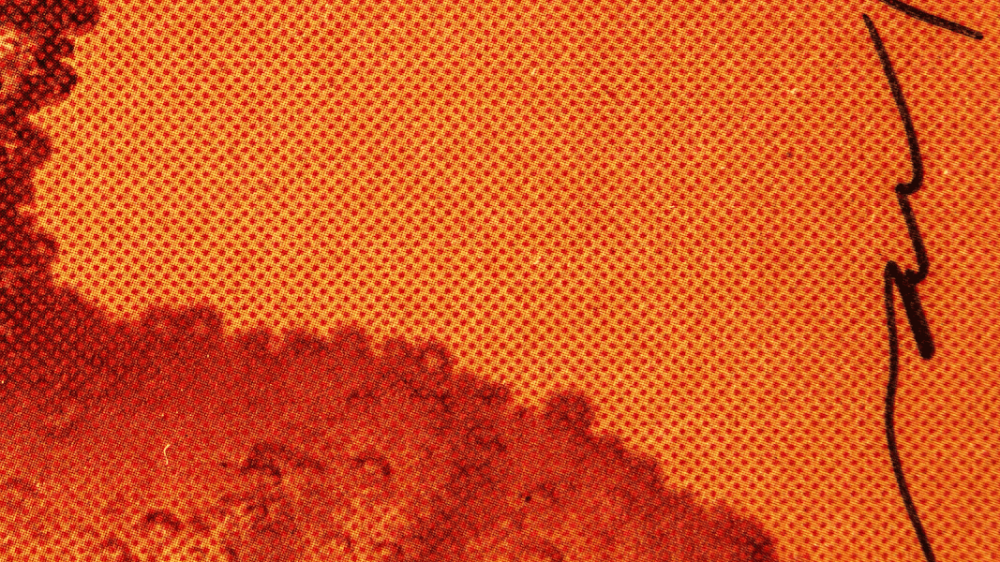

# WonderAI

由AI算法制作和随机制作的2,000种精彩艺术集合。什么是 WonderAI？
WonderAI 是一个 NFT（Non-fungible token）集合。存储在区块链上的数字艺术品集合。 有多少 WonderAI 代币？
总共有 2,000 个 WonderAI NFT。目前 262 位所有者的钱包中至少有一个 WonderAI NTF。最近卖出了多少 WonderAI？
过去 30 天内售出 0 个 WonderAI NFT。 什么是流行的 WonderAI 替代品？
许多拥有 WonderAI NFT 的用户还拥有 EL NUMEROS、DegenOkayBears、WaterBe4nZuki 和 Old Legacy。过去 7 天没有售出 WonderAI。WonderAI NFT - 常见问题（FAQ）这是最棒的艺术品。

