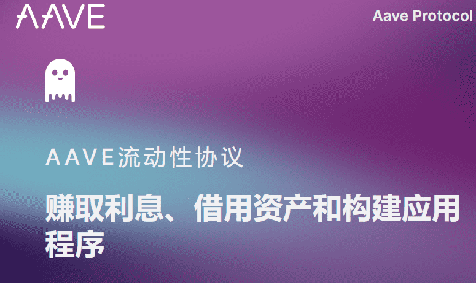
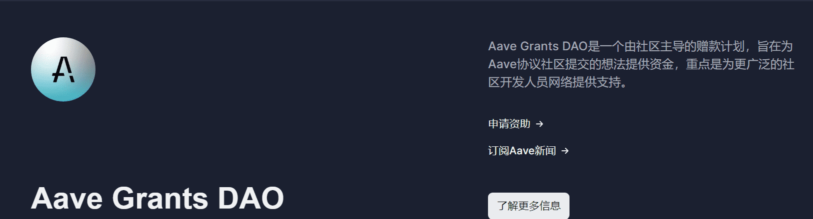
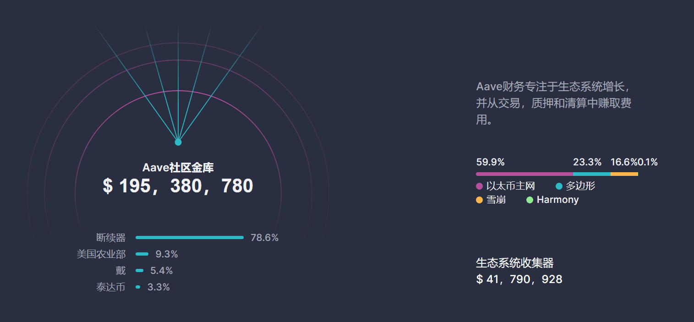

# Aave

**Aave协议是一种分散的、开源的和非拘禁货币市场协议。**储户通过向贷款池提供流动性来赚取利息，而借款人可以通过以过度抵押或低抵押的方式利用这些池来获得贷款。

**Aave协议的独特之处在于**，它将存款令牌化为实时累积利息的令牌。它还具有获得高度创新性的闪存贷款，使开发人员可以立即轻松地借款；无需抵押品。

Ave协议拥有16种不同的资产，其中5种是稳定币，是以太坊生态系统中最多样化的贷款池。

**它是如何运作的**

**1**

------

提交 Aave 征求意见（ARC）

与社区成员讨论并接收反馈。

**2**

创建快照

通过快照评估社区对新提案的情绪。

**3**

提交 Aave 改进请求 （AIP）

该提案通过 GitHub 拉取请求提交，社区对批准进行投票

Aave协议通过协议破产的安全后盾进行保护。该协议目前以价值300，974，949美元的Aave代币进行保护。

**由社区管理**

Aave是一个完全分散的社区治理协议，拥有超过**100000**个代币持有者。
