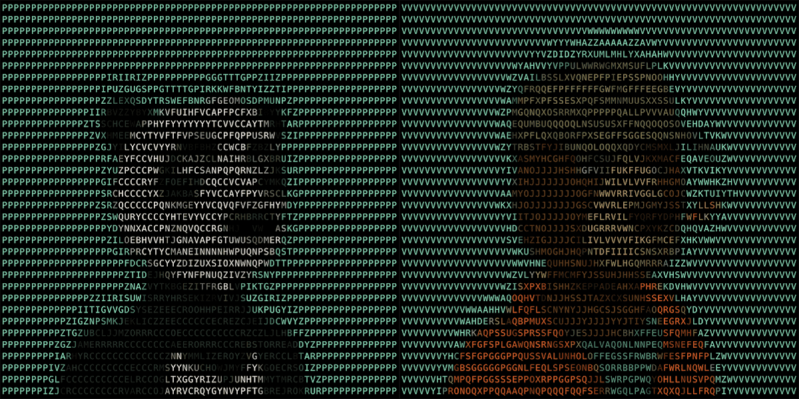

# ABC Bears

ABC Bears NFT - 常见问题（FAQ）
▶ 什么是 ABC 熊？
ABC Bears 是一个 NFT（不可替代代币）集合。存储在区块链上的数字艺术品集合。
▶ ABC Bears 代币有多少？
总共有 4,064 个 ABC Bears NFT。目前，354 位所有者的钱包中至少有一个 ABC Bears NTF。
▶ ABC Bears 最昂贵的促销活动是什么？
最昂贵的 ABC Bears NFT 是 ABC Bears #0。它于 2022-06-06（3 个月前）以 9.1 美元的价格售出。
▶ 最近卖出了多少 ABC Bears？
过去 30 天内售出了 2 个 ABC Bears NFT。过去 7 天没有卖出任何 ABC Bears。

