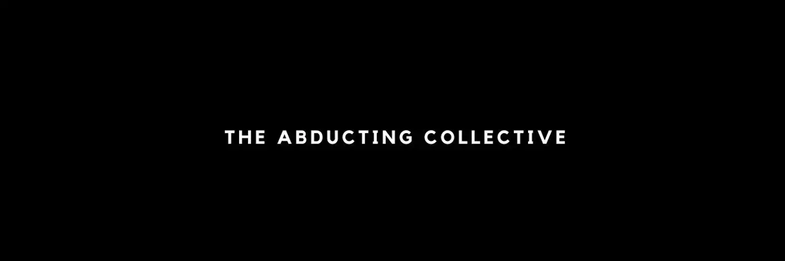

# Abducting Mfers Depolyer V2

绑架集体：v2 NFT 在过去 7 天内售出 89 次。 绑架集体：v2 的总销售额为 5.61 万美元。 一个被绑架的集体：v2 NFT 的平均价格为 63 美元。 有 1,208 个绑架集体：v2 所有者，拥有 4,210 个代币的总供应量。

现实生活中的持有者津贴 + 社区驱动的项目 + 有机💧 | doxxed 🥽 | 没有不和谐，没有废话

10% 的绑架集体：v2 销售额为 43 美元或更低，一半销售额低于 66 美元，最高的 10% 售价为 76 美元或更高。

什么是绑架集体：v2？
绑架集体：v2 是一个 NFT（非同质代币）集合。 存储在区块链上的数字艺术品集合。

