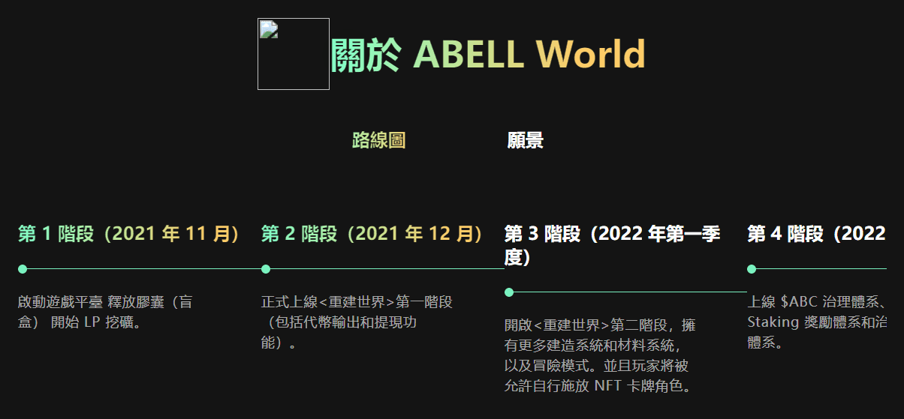
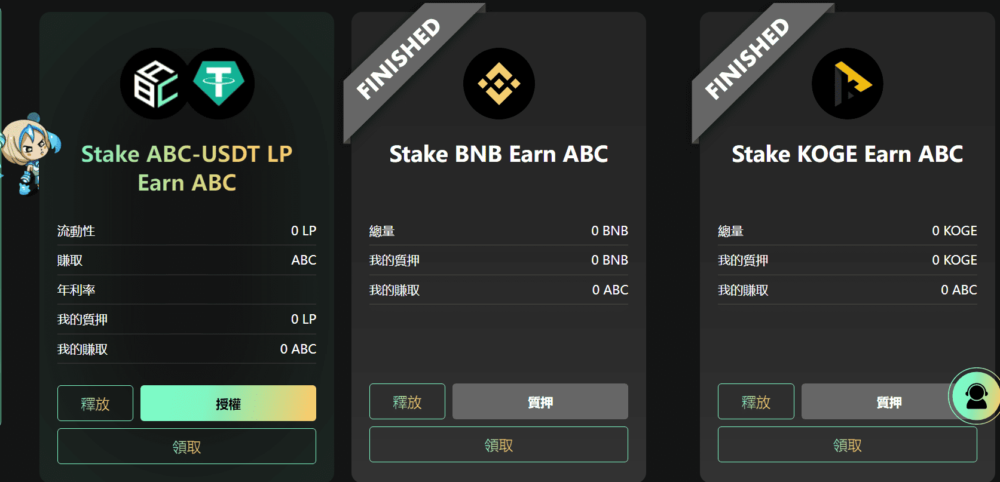
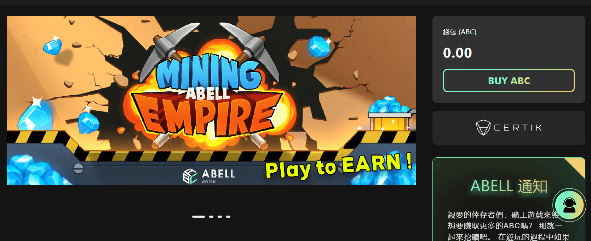

# Abell World

**Abel World是一个基于区块链的分散式游戏平台。**但我们更希望人们将阿贝尔世界视为一个平行的世界。如果您也同意我们的观点，它将是一个超越物理形式的沉浸式互联网宇宙。**Abell World将把数据存储在IPFS上，**以确保数据安全，这将非常酷！并结合DEFI和NFT的优势，为整个元宇宙奠定经济基础，同时为玩家带来游戏体验和经济利益。

该团队的目标是通过构建不同的虚拟空间和游戏来创建一个丰富多彩、开放和分散的元宇宙。

我们将干预生态系统，尽可能少地修改规则，从一开始就使规则尽可能简单有效，并专注于开发乐趣和系统架构。

除了最初将发布一些FT胶囊（盲盒）外，玩家可以通过在后期收集资源来自行铸造NFT。

Abel团队不会在Abel World项目内持有任何硬币和虚拟资产，以确保项目的公平性和开放性。

团队的主要收入是市场上的佣金，收入将用于保持发展进步和社区治理。

未来，Abellworld将开发多个游戏和虚拟世界，以构建多个空间并使其相互连接。

