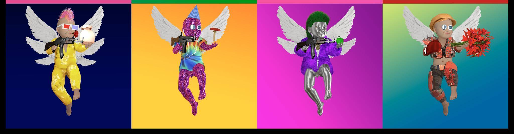

# Angel Baby Hit Squad by Fettuccine & Team

Angel Baby Hit Squad 是第一个具有 Cardano Utility 的以太坊 NFT。 11,111 位天使每人以 0.0777 eth 的价格下降，所有这些都是独一无二的，有 7 个 Ultimate pulls。 通过购买 NFT 并持有它，您将在 Cardano 钱包中获得空投。 我们正在与创建这座桥的 Lovelace MAAS 合作。

Fettuccine & Team NFTs 的 Angel Baby Hit Squad 在过去 7 天内售出 18 次。 Fettuccine & Team 的 Angel Baby Hit Squad 的总销售额为 1.08 万美元。 Fettuccine & Team NFT 的 Angel Baby Hit Squad 的平均价格为 60.2 美元。 Fettuccine & Team 拥有者共有 2,047 个 Angel Baby Hit Squad，总供应量为 7,848 个代币。

