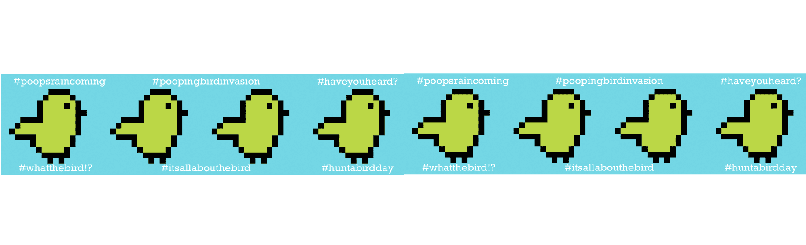

# About the BIRD

ATB 是手工制作的，不是自动生成的，生活在以太坊 blablabird 中......🛑经过社区投票🛑：这个系列将成为 Genesis One。 总供应量：55。接下来我们将在 ERC721 上创建第一代迁移，并永久关闭这个（ERC1155）。 创世纪的所有鸟类都是通过不和谐服务器中发生的赠品获得的礼物。 每个人都可以有发言权并决定这只鸟的未来！ 加入我们 ！ - 一旦他们的项目上线，所有拥有一只鸟的活跃成员都将收到一个 $FLAG 空投代币（来自战利品和荣耀收益公会）。 - 下一代的名字将是“新鸟令”，并且非常有限。 - 启动 TBA，但要在 2022 年之前说 ⚡️继续关注并在 discord 和 Twitter 上加入我们！⚡️

