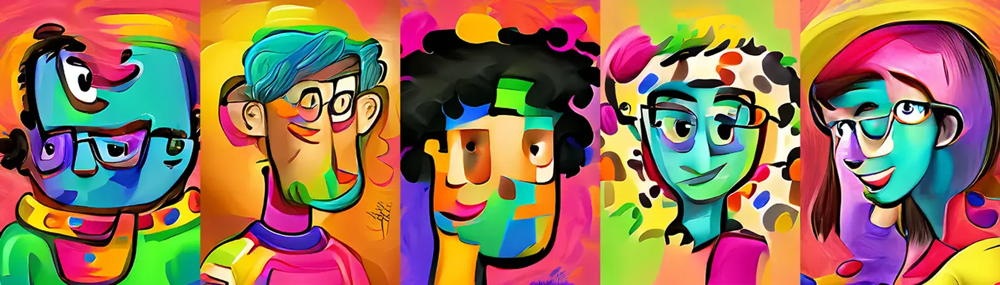

# Abstract Pepls

Abstract Pepls 是由 AI 生成的 8,350 张有趣和疯狂的 Pepls 肖像的集合。 你和我都是Pepls。 我们正在为这个熊市添加颜色。每个 Abstract Pepl 的灵感来自来自 https://abstract-pepls.devdad 的 Crypto Punks、Cool Cats、CyberKongz、Murakami.Flowers、BAYC、Azuki 和 Doodles.Mint 的艺术作品。 xyz/。 薄荷 1 nft = 免费。 薄荷 2 = 0.0025 eth。 铸币厂 3 = 0.005 eth。 每个钱包最多 3 个。

什么是抽象Pepls？
Abstract Pepls 是一个 NFT（非同质化代币）集合。 存储在区块链上的数字艺术品集合。
▶ 有多少 Abstract Pepls 代币？
总共有 428 个 Abstract Pepls NFT。 目前，40 位所有者的钱包中至少有一个 Abstract Pepls NTF。
▶ 什么是最昂贵的 Abstract Pepls 销售？
售出的最昂贵的 Abstract Pepls NFT 是 322。它在 2022 年 6 月 15 日（2 个月前）以 16.3 美元的价格售出。
▶ 最近卖出了多少 Abstract Pepls？
过去 30 天内售出了 2 个 Abstract Pepls NFT。

