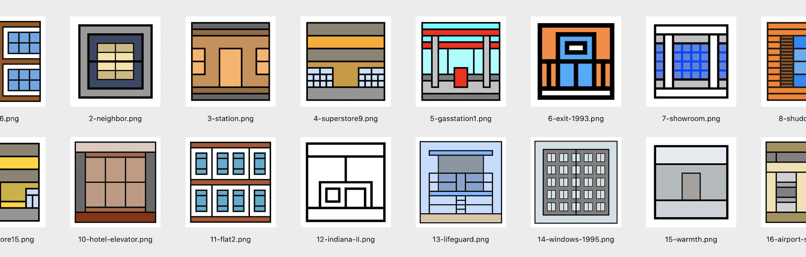

# The ABSTRACT Store

经过
杰夫戴维斯
为获得 $ABST 的收藏家准备的特别礼物。

ABSTRACT Store NFT 在过去 7 天内售出 1 次。 The ABSTRACT Store 的总销售额为 59.09 美元。 一个 The ABSTRACT Store NFT 的平均价格为 59.1 美元。 The ABSTRACT Store 拥有 186 名所有者，总共拥有 62 个代币。

为获得 $ABST 的收藏家准备的特别礼物。

过去 7 天没有出售 Crypto GAN 花束。

存储在以太坊区块链上的 GAN 生成的抽象花束令牌的集合。 这是从通用花束中抽象出来的独特花束的精选系列，只为您带来最好的美学。

