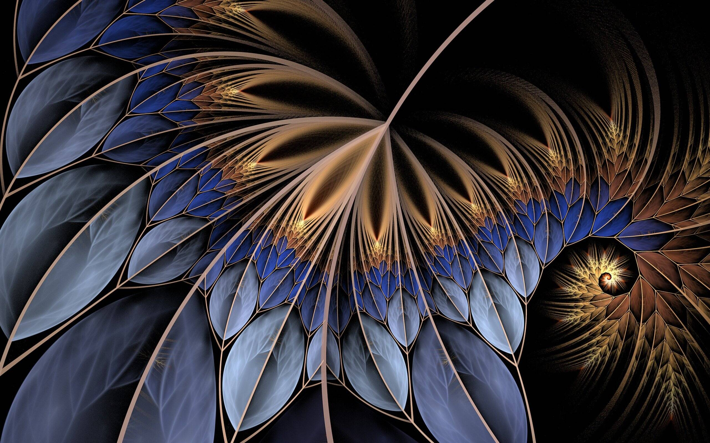

# Abstractions

以抽象为特色的集合。 探索Explorechevron_right； bar_chartStatschevron_right; library_booksResourceschevron_right; mode_night 夜间模式； 连接钱包

我从 2020 年 12 月开始的第一个 AI 驱动的动漫肖像实验之一。我将把这些作品作为 OpenSea 上的 Abstractions 收藏的一部分。

什么是战争工具的抽象？
Abstractions of War Instruments 是一个 NFT（Non-fungible token）集合。 存储在区块链上的数字艺术品集合。
▶ 存在多少个战争工具抽象代币？
总共有 4 个抽象战争工具 NFT。 目前，21 位所有者的钱包中至少有一个 Abstractions of War Instruments NTF。
▶ 最近卖出了多少抽象战争工具？
在过去 30 天内售出 0 个 Abstractions of War Instruments NFT。

