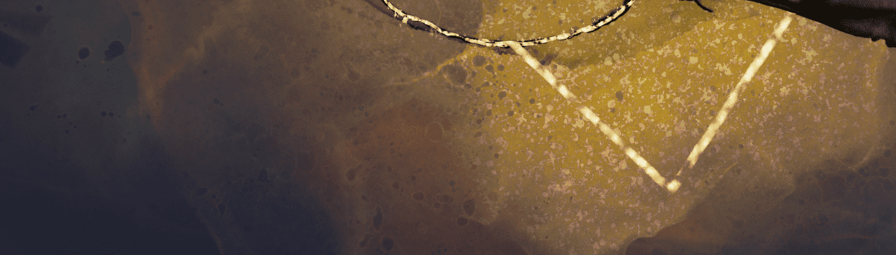

# Abstractus Galaxias

Abstractus Galaxias 是探索宇宙的 420 篇摘要的集合。 精心设计的 2000x2000 像素的 125 种不同画笔，精心策划的艺术品描绘了一颗新星的诞生。

什么是抽象星河？
Abstractus Galaxias 是一个 NFT（不可替代代币）集合。 存储在区块链上的数字艺术品集合。
▶ 有多少个 Abstractus Galaxias 代币？
总共有 419 个 Abstractus Galaxias NFT。 目前，317 位所有者的钱包中至少有一个 Abstractus Galaxias NTF。
▶ 最近卖出了多少台抽象星河？
过去 30 天内共售出 0 个 Abstractus Galaxias NFT。
▶ 什么是流行的 Abstractus Galaxias 替代品？
许多拥有 Abstractus Galaxias NFT 的用户也拥有

