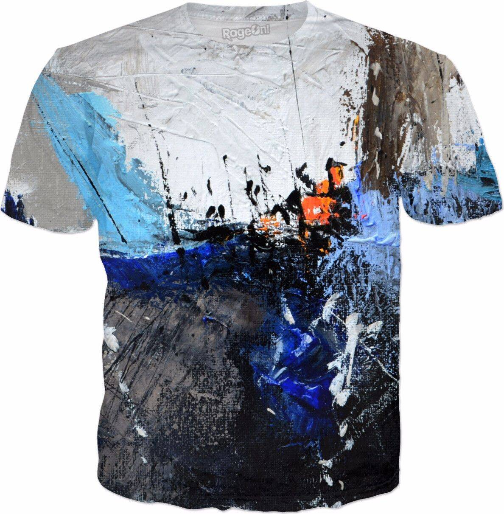

# abstractwear

非具象体素服装

abstractwear NFT - 常见问题（FAQ）
▶ 什么是抽象服装？
abstractwear 是一个 NFT（不可替代令牌）集合。 存储在区块链上的数字艺术品集合。
▶ 有多少抽象服装代币？
总共有 4 个抽象服装 NFT。 目前，11 位业主的钱包中至少有一件抽象服装 NTF。
▶ 最近卖出了多少抽象服装？
过去 30 天内售出了 0 个抽象服装 NFT。

一系列抽象艺术作品，包括素描、绘画、拼贴、组合和启发自发的创造性表达。

