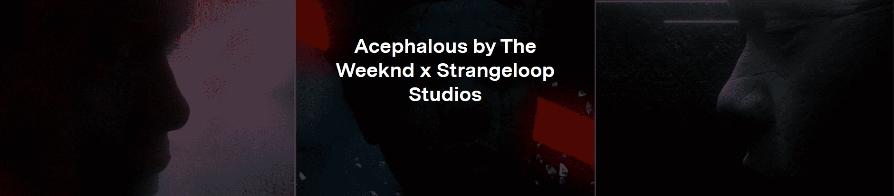

# Acephalous Open Editions by The Weeknd x Strangeloop Studios

Acephalous 是 Abel “The Weeknd” Tesfaye 和洛杉矶设计团队 Strangeloop Studios 的 5 件作品的集合。 The Weeknd 和 Strangeloop Studios 自 2015 年以来就在音乐会视觉和视听作品上进行合作，在每个专辑周期和巡回设计的风格排列中建立了一条始终保持一致的美学线索。每件作品的描述都包含来自 Ta-Nehisi 等思想家的题词 Coates、Judith Butler、George Battailles、Susan Sontag、James Baldwin 和 Walter Benjamin，探讨视听作品的主题张力：原创与复制、稀缺与可访问性、记忆与神话。

经过WEEKND部署者
该作品的描述包含来自 Ta-Nehisi Coates、Judith Butler、George Battailles、Susan Sontag、James Baldwin 和 Walter Benjamin 等思想家的题词，这些题词激发了视听作品的主题张力：原创与复制、稀缺性 与可访问性，记忆与神话。

