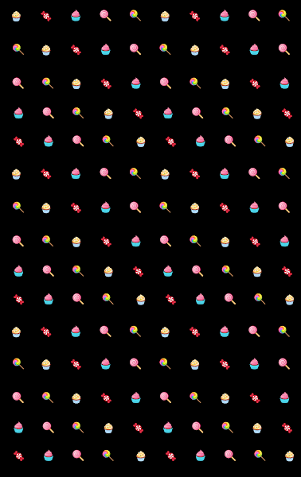

# Acid Apes Candy Syndicate V2

Acid Apes Candy Syndicate 是一个基于 MAYC 的 NFT 衍生项目，专注于回馈社区。 我们不以任何方式隶属于 MAYC。

Acid Apes Candy Syndicate V2 - 系列 | OpenSea Acid Apes Candy Syndicate V2 Acid Apes Candy Syndicate 是一个基于 MAYC 的 NFT 衍生项目，专注于回馈社区。 我们不以任何方式隶属于 MAYC。 88 件商品 40 位业主 --- 底价 0.19 总数量 商品活动状态 expand_less expand_more expand_more

▶ 什么是酸猿俱乐部？
Acid Apes Club 是一个 NFT（Non-fungible token）集合。 存储在区块链上的数字艺术品集合。
▶ 有多少 Acid Apes Club 代币？
总共有 50 个 Acid Apes Club NFT。 目前 2 位所有者的钱包中至少有一个 Acid Apes Club NTF。
▶ 酸猿俱乐部最近卖了多少？
过去 30 天内售出 0 个 Acid Apes Club NFT。

