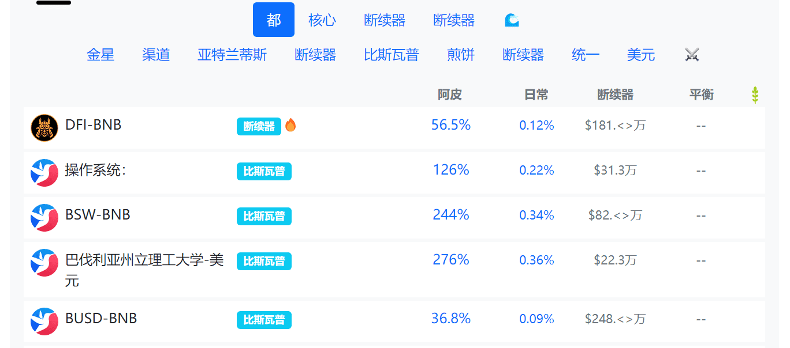
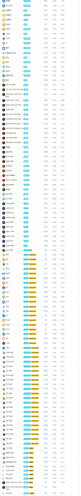

# ACryptoS

开始

CryptoS在Binance Smart Chain、Vaults和Stables上提供2种产品Wap。

我们的托克经济学和费用旨在鼓励长期赌注，并奖励我们ACS和ACSI本地人的长期代币。

Cryptos金库

ACryptos Vaults通过自动收益策略增加您的资产。这节省了用户的时间，并通过更频繁的复合、更高效的天然气利用和其他创造性的自动化实现更高的产量。

当您存入金库时，您的代币将随着时间的推移而增长。您无需手动收割拱顶。

CryptoS稳定交换

CryptoS StableSwap是一家自动化做市商（AMM），可以在Binance Smart Chain上以最优惠的价格进行快速高效的稳定币交易，并收取低滑移和费用。

CryptoS农场

ACS和ASI通过ACryptoS Farms分发，以激励流动性提供商，并与我们的用户分享协议的股份。

农场需要手动收割。

ACS和ACSI原生代币

ACS 是我们的原生代币。押在ACS金库的ACS从金库和ACS农场收取协议费用和奖励，并将在未来参与协议的治理。

ASI是StableSwap的原生代币，可能也是所有未来的非保险库产品。ACSI在ACSI金库中持有股份，会从StableSwap和ACSI Farms获得协议费用和奖励，将来可能会参与协议的治理。

托克经济学和费用

我们的代币经济学和费用旨在鼓励长期赌注，并奖励我们ACS和ASI原生代币奖励和费用的长期持有人。这意味着，如果您作为流动性提供商快速进出，您可能会获得0甚至略微负的回报。

在继续之前，请仔细查看我们的费用文件。

####  ACryptoS现在是多链的。

我们的大多数保管库不再在此 UI 上列出。
使用我们新的 [V2 UI](https://app-v2.acryptos.com/) 来选择我们完整的保管库和农场。
试试我们实验性的 [X UI](https://app-x.acryptos.com/)，了解我们的下一代多链保险库

