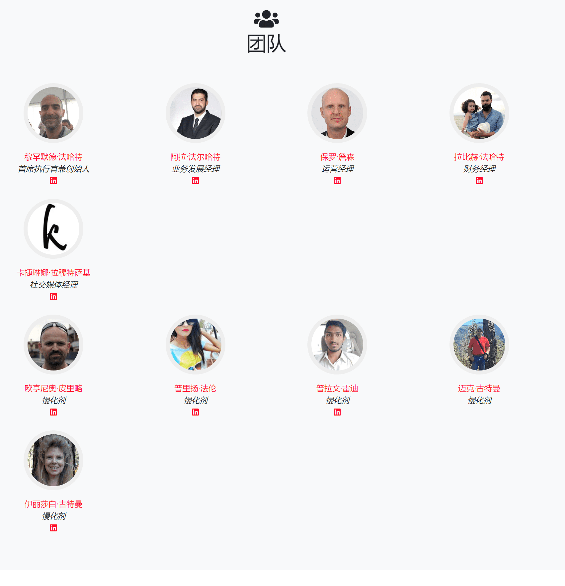
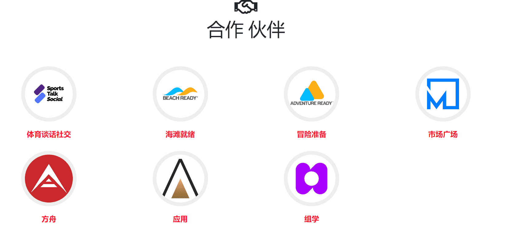
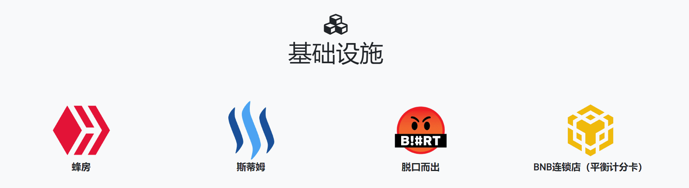

# Actifit

**Actifit通过使您能够跟踪日常活动并获得奖励来激励健康生活**。

Actifit（AFIT）代币，也可以通过对Steem帖子的投票获得STEEM奖励。

奖励包括AFIT代币 - Actifit的实用程序和奖励代币，还包括HIVE，STEEM，BLURT和SPORTS代币奖励，通过在支持的区块链和合作伙伴社区上投赞成票。

AFIT代币可以在Actifit市场上兑换，以注册健身或营养相关的咨询会议，购买电子书，通过购买基于actifit的助推器小工具提高您的奖励，或赚取额外的HIVE奖励！
您可以在以下位置购买AFIT代币：

[蜂巢-Engine.com（蜂巢版）](https://hive-engine.com/?p=market&t=AFIT)

[Actifit DeFi （BSC Version）](https://defi.actifit.io/)

[煎饼（平衡计分卡版）](https://pancakeswap.finance/swap?inputCurrency=BNB&outputCurrency=0x4516bb582f59befcbc945d8c2dac63ef21fba9f6)

## 使用 Actifit 进行收益农业

如果您是Hive和/或Steem区块链上的令牌持有者，则可以产生农场AFIT令牌。Stake/Power Up to Hive Power / Steem Power，委托给Actifit并赚取您每天分配给我们的委托人的AFIT代币池的份额，以及每周5%的actifit帖子受益人奖励的份额。

