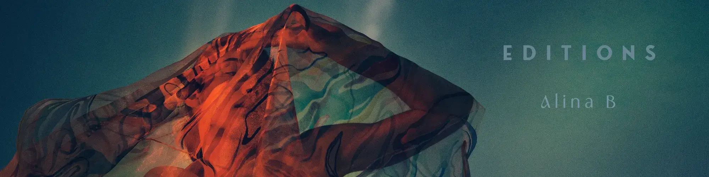

# Any Colour You Like when there's none - Editions

没有任何你喜欢的颜色 - 是“胶囊、贝壳、针迹、层”的一部分，作为版本发布。 “胶囊、贝壳、缝线、层”——是一系列开放性问题和对我与环境接触的反思。 每当我发现自己是试图实现我的身份和界限的大型人类过程的一部分时，都会发生这种情况。 重新思考在新环境中的体验就像不断撕开缝线以使裙子适合我的新身体形状。 当环境吸收、否认、取消、接受我时，感觉如何？许可证：扩展编辑可用于私人展示，或在商业和非商业环境中，或在不限数量参与者的群体中展示。 该许可证包括 NFT 持有者在虚拟或物理画廊、纪录片和论文中的无限使用和展示。 不提供创作商业商品、商业发行或衍生作品的权利。 版权归创作者所有。

