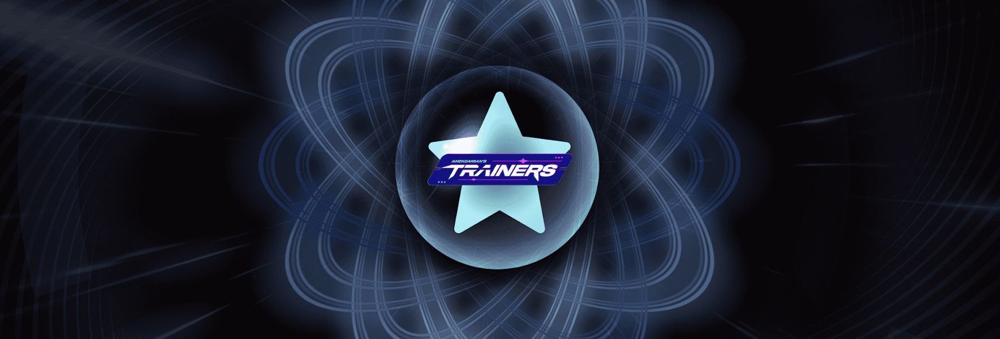

# A/D Elementals

在 A/D 世界中有 4 个基本元素：火、水、草和精神。 然而，有传言说特殊元素在四处飘荡。 特殊元素极为稀有且备受追捧。 除了非视觉（统计）之外，元素卡还将用于在视觉上升级您的教练。 这些卡片也会在进化你的灵魂生物时发挥作用，所以明智地选择训练师！ 在 A/D Trainers 中找到 A/D 生态系统的起点。

A/D Elementals NFT - 常见问题（FAQ）
▶ 什么是 A/D Elementals？
A/D Elementals 是一个 NFT（不可替代代币）集合。 存储在区块链上的数字艺术品集合。
▶ 有多少 A/D Elementals 代币？
总共有 5 个 A/D Elementals NFT。 目前，494 位所有者的钱包中至少有一个 A/D Elementals NTF。
▶ 最近卖出了多少 A/D 元素？
过去 30 天内售出 0 个 A/D Elementals NFT。

