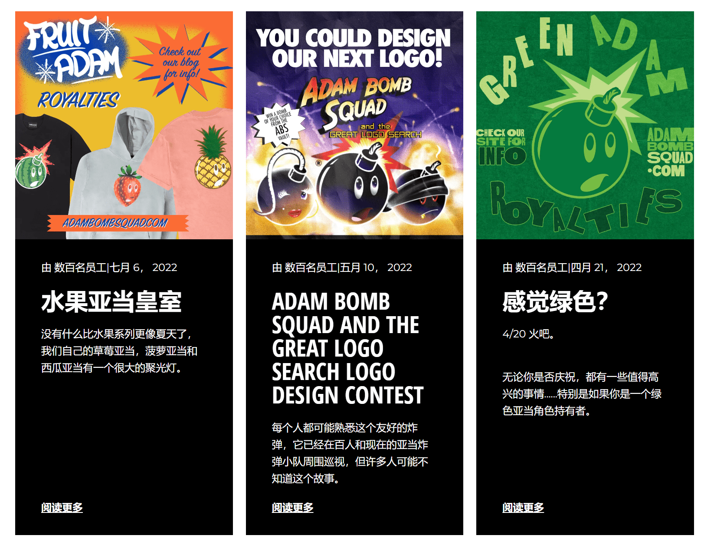
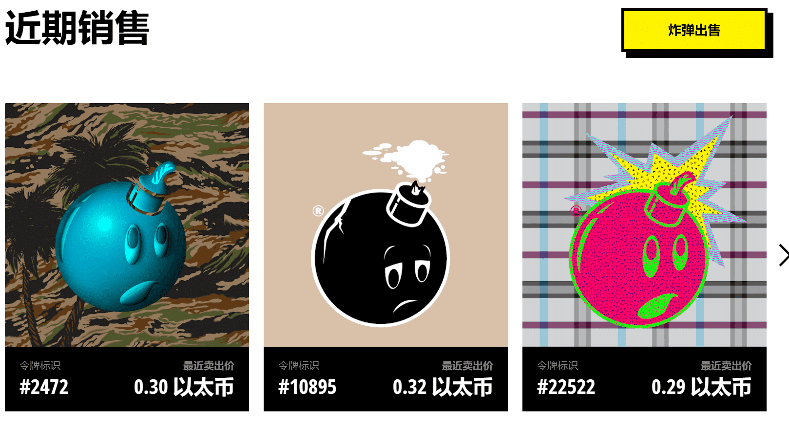
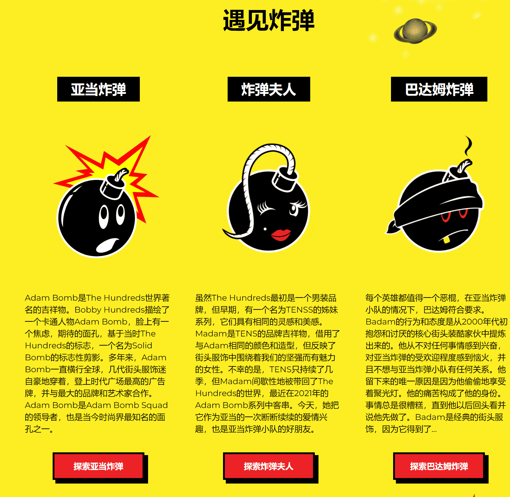

# Adam Bomb Squad

**Adam Bomb Squad**是The Hundreds的一个FT项目，由25,000枚独特的炸弹组合和与我们过去二十年的历史相关的背景组成。

亚当炸弹小队NFT现在正在出售。我们将在太平洋标准时间8月31日星期二下午6点之前“吹掉”任何不出售的NFTS。太平洋标准时间8月31日星期二晚上9点，您的炸弹将被揭晓。

The Hundreds是一个全球性的、以社区为基础的街头服饰品牌，其重点是“人胜于产品”。

Bobby Kim（Bobby Hundreds）和Ben Shenassafar（Ben Hundreds）成立于2003年，他们用一间工作室公寓和口袋里的现金制定了这个项目。十八年后，The Hundreds被视为街头服装的支柱，我们的旗舰店位于费尔法克斯区，并与阿迪达斯，迪士尼，斯坦利库布里克，尼普西哈斯勒，美洲狮，杰克逊波洛克，百事可乐，回到未来，Larva Labs和无聊的猿类游艇俱乐部等公司合作。

在过去的二十年中，The Hundreds通过博客，媒体平台和社交存在，在将几代年轻艺术家和收藏家带入街头服饰方面发挥了重要作用。通过Adam Bomb Squad，The Hundreds抓住了NFT，区块链技术和元宇宙，再次将其社区引入下一个世界。

一直以来，我们都在这里教授数百人的历史，并为NFT爱好者提供有趣，可收藏的体验。

要了解有关Adam Bomb Squad的目的以及我们在NFT，加密和元宇宙中的立场的更多信息，请阅读Bobby Hundreds撰写的白皮书。

