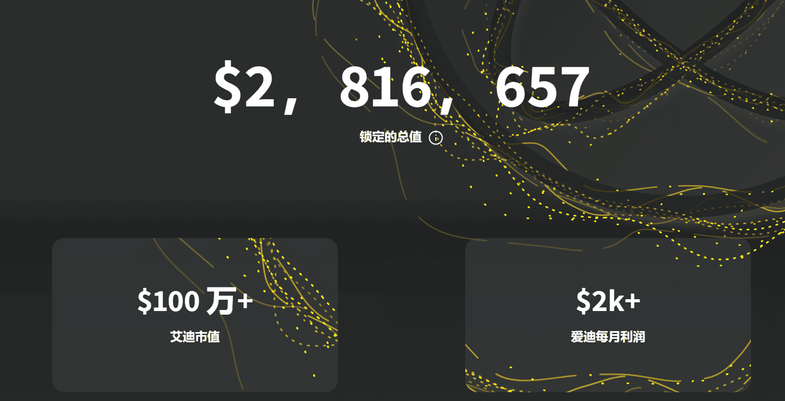
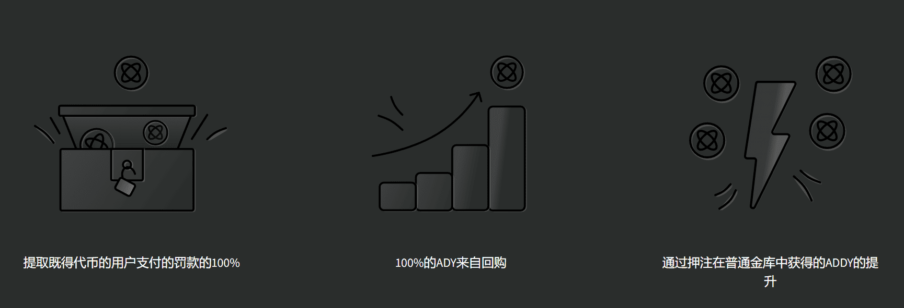
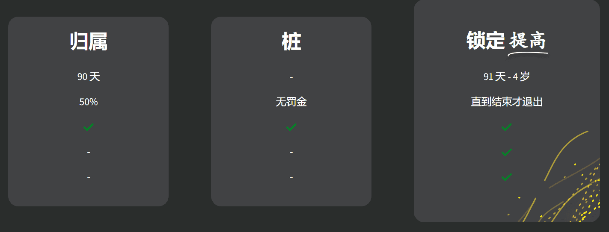

# Adamant Finance

Adamant是一个收益率优化器保险库，为用户提供了一种简单安全的方法，可以自动复合Mtic/Polygon网络上的代币，并最大限度地提高收益率。

Adamant是一个产量优化器保险库，允许用户轻松安全地最大化其产量农业收入。

### 通过坚毅实现产量最大化

坚韧的技术使最大化您的产量农业收入变得容易。
您选择最适合您的保管库，存入该金库，Adamant通过每天复利多达1000多次来自动最大化您的收益。您还可以节省天然气并避免手动产量农业的麻烦。

用户可以随时提款。

由于达盟金库合同的高效率，达盟的表现 [费用](https://adamantfinance.gitbook.io/adamant-finance/guides/vaults) 也是多边形上最低的。

押注Adamant的原生代币ADDY，从Adamant的金库中赚取绩效费红利。抵押人可以从整个Polygon DeFi场景中获得回报，而无需管理多个平台和农场。

此外，高达50%的绩效费用于回购ADDY，以对其造成通货紧缩压力。

