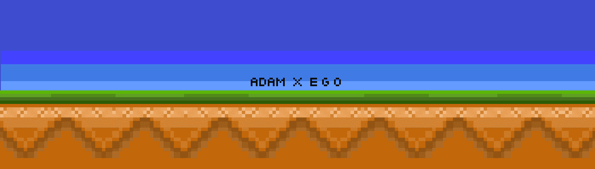

# ADAM X EGO

历史亚当咬下苹果的那一刻，他不知道会发生什么。 因为道歉，亚当后裔的自我分为善恶。 由于自我不再可控，善恶追随者的历史开始了。 善与恶的对决，最终书写了一场战争的叙事。Adam生成艺术“Adam X Ego”由576像素组成，配备独特物品，拥有10,000个特征人物。“Adam X Ego”由5,000个善创造 身份和5000个邪恶身份，可以在Klaytn区块链上正式拥有，每个亚当的等级将根据佩戴的物品来确定。

