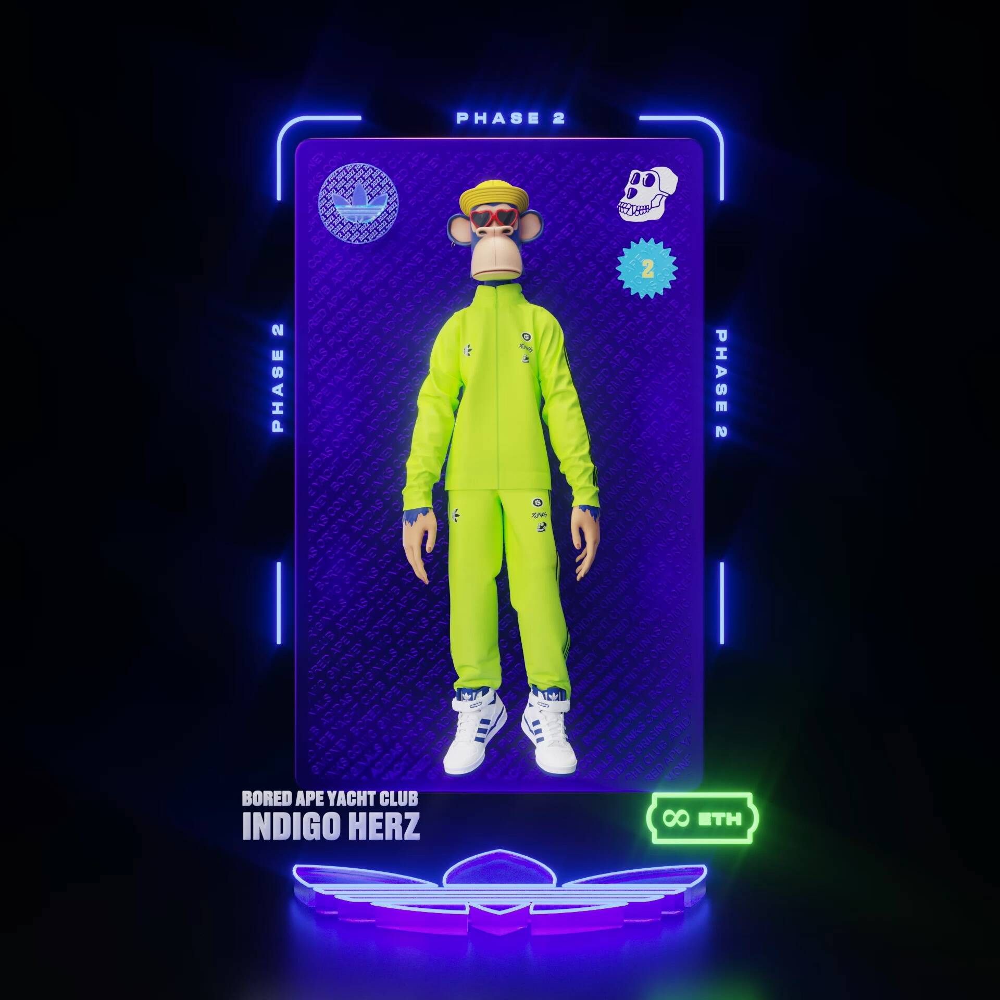

# adidasphase3.com

adidasphase3.com 是一个 NFT（Non-fungible token）集合，即存储在区块链上的数字艺术作品的集合。adidasphase3.com 集合现在包括 8691 个 NFT。这 8691 个 NFT 现在由 26 个所有者拥有。

过去 7 天，adidasphase3.com NFT 的平均价格为 0.05 ETH 或 77.73 欧元或 77.84 美元。adidasphase3.com NFT 系列可在 Opensea 市场上出售。您可以通过单击此处访问它，许多拥有 adidasphase3.com NFT 的用户还拥有Something Official、Bored Ape Yacht Club、RR/BAYC、Just Ape。adidasphase3.com Into the Metaverse 是 adidas Originals 与 NFT 先驱 gmoney、Bored Ape Yacht Club 和 PUNKS Comic 合作、共同创建的 NFT 项目。发展到第 2 阶段。条款和条件

