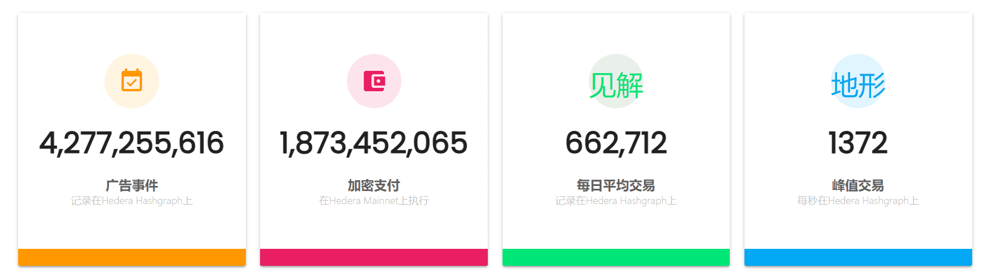
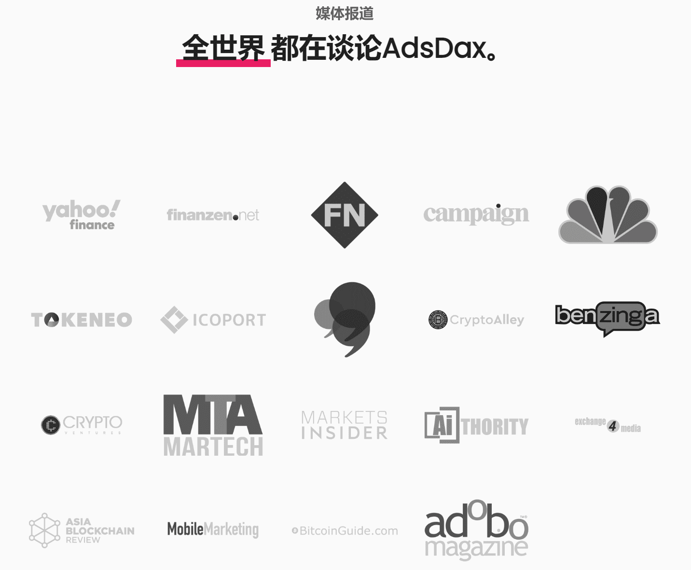
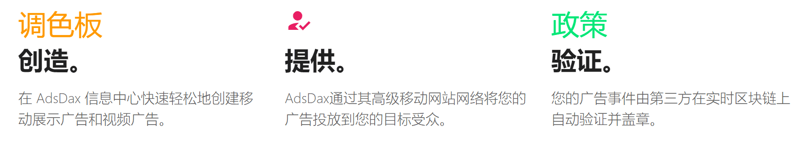

# AdsDax

AdDax是一个自助广告平台，利用分布式分类账技术为广告商、代理商、品牌和出版商解决广告行业的问题。

我们使广告商能够创建、交付、验证和优化富媒体mobiel广告活动。

**AdsDax是一个区块链广告平台和市场**，用于创建，购买，验证和销售广告。

## 什么是ADSDAX？

### 一个富媒体广告平台。

AdsDax是一个自助式广告平台，利用区块链和分布式账本技术来解决广告商，代理商，品牌和出版商的广告行业问题。

我们使广告主能够创建、投放、验证和优化富媒体移动广告活动。

### AdsDax是一个实时平台。

这不仅仅是一份白皮书或概念验证。目前，AdsDax 平台每月收到数亿个广告请求，并已管理超过 25 个广告时代前 100 大品牌的广告系列。

AdsDax在区块链上实时跟踪广告事件，以确保广告商实现其目标并充分利用其广告支出。

## 优点

### 对于广告商

AdsDax 使广告商能够在其富媒体广告活动上创建、交付、优化和获得区块链支持的验证，所有这些都在一个简单易用的仪表板中完成。

### 对于发布者。

发布商可以从更高的透明度、更高的收入、更快的付款速度以及他们提供给广告客户的广告资源的更公平价格中受益。

