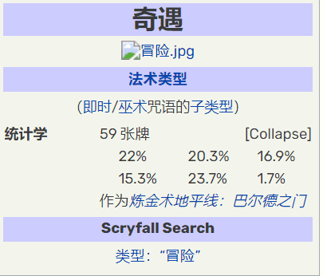
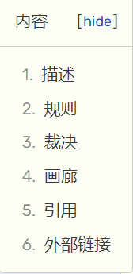
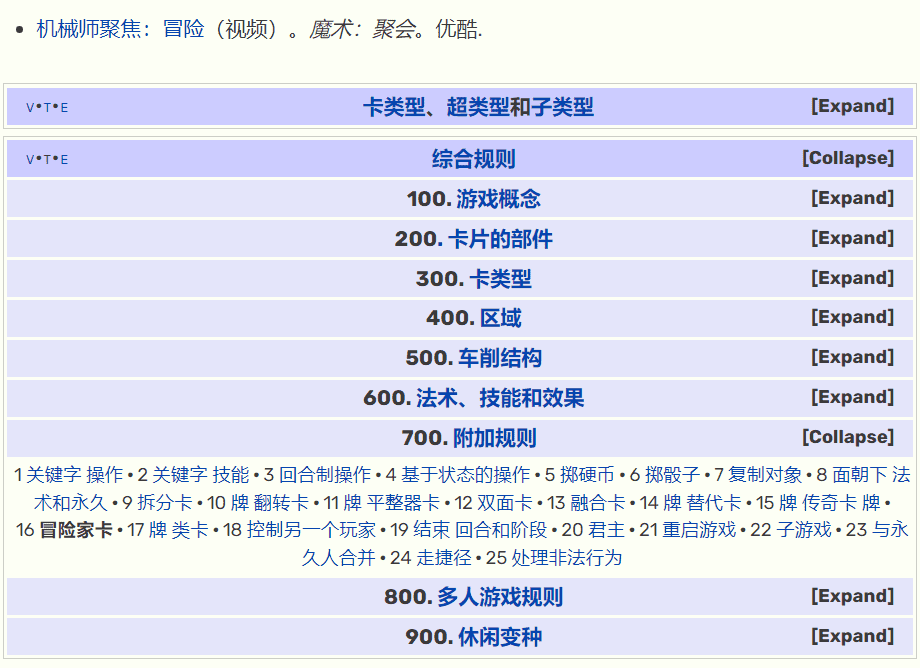

# Adventure Cards

冒险卡是第一个完全存储在链条上的收藏卡牌游戏。

每个NFT包括45张程序生成的卡片，足以玩一个完整的游戏。

受LOOT和MtG的启发，冒险卡是加密原语。你可以和他们一起做任何你想做的事。他们可以自由铸造（除了......你知道......汽油）

有四种类型的卡片：生物、神器、魔法和咒语。

你应该注意到里面有一些熟悉的东西。

将冒险的一半卡牌投掷为将生物送**上冒险，**然后再将其投入[战场](https://mtg.fandom.com/wiki/Battlefield)。[[3\]](https://mtg.fandom.com/wiki/Adventure#cite_note-3)当冒险解决时，卡牌被流放。当作为决议的一部分被流放时，该生物可能会被流放。

冒险法术只存在于[堆栈](https://mtg.fandom.com/wiki/Stack)上。在所有其他[区域](https://mtg.fandom.com/wiki/Zone)，冒险的特征都被忽视了。只有生物卡的特征适用。[[注4\]](https://mtg.fandom.com/wiki/Adventure#cite_note-4)

从理论上讲，这些[规则](https://mtg.fandom.com/wiki/Rules)将允许冒险出现在非生物永久状态下。[[注5\]](https://mtg.fandom.com/wiki/Adventure#cite_note-5)

冒险在*[指挥官传奇：鲍尔德之门之战](https://mtg.fandom.com/wiki/Commander_Legends:_Battle_for_Baldur's_Gate)*中再次出现。[[6\]](https://mtg.fandom.com/wiki/Adventure#cite_note-6)[[7\]](https://mtg.fandom.com/wiki/Adventure#cite_note-7)它们被证明是[《龙与地下城》](https://mtg.fandom.com/wiki/Dungeons_%26_Dragons)跨界布景的完美搭档。它们被调味为玩家在冒险中采取或忍受的行动，然后[永久](https://mtg.fandom.com/wiki/Permanent)被调味成你随后在该任务中遇到的东西，无论是怪物还是很酷的新魔法物品。由于后者，冒险可能首次成为[人工制品](https://mtg.fandom.com/wiki/Artifact)，成为他们的永久一半。

- 冒险家卡是除堆栈之外的每个区域中的生物卡，以及堆叠中的生物卡，如果不是作为冒险进行施放。[[9\]](https://mtg.fandom.com/wiki/Adventure#cite_note-9)在这些情况下，忽略它的替代特征。例如，当它在你的墓地里时，巨人杀手是一张白色生物卡，其[转换后的魔法值为](https://mtg.fandom.com/wiki/Converted_mana_cost)1。它不可能是神秘圣所触发能力的目标。
- 当施放咒语作为冒险时，使用替代特征并忽略卡牌的所有正常特征。法术的颜色、魔法消耗、转换后的魔法值成本等等，都是由那些替代特征决定的。如果咒语离开堆栈，它会立即恢复使用其正常特征。
- 如果你将一张冒险者卡牌作为冒险，请仅使用其替代特征来确定施放该咒语是否合法。例如，如果巨人杀手被流放，拥有野外冠军费雯丽的最后一项能力，你不能把它施放为斩首。
- 如果一个咒语被施放为冒险，它的控制者会流放它，而不是在它解决时把它放逐到它的主人的墓地。只要它仍然被流放，该玩家就可以将其施放为生物咒语。如果冒险法术以除解决以外的任何方式离开堆栈（很可能是通过反击或未能解决，因为它的目标都变得非法），则该卡牌将不会被流放，并且该法术的控制者以后将无法将其作为生物施放。
- 如果一张冒险者卡最终因为任何其他原因而流亡，而不是在解决时流放自己，它不会允许你把它作为生物法术施放。
- 你仍然必须遵守任何时间限制和权限，以使用你从流放中施放的生物法术。通常，你只能在主阶段，当堆栈是空的时，你才能施放它。
- 如果一个效果复制了一个冒险咒语，则该副本会在解决时被流放。它不再作为一种以国家为基础的行动而存在。不可能将副本作为生物进行投射。
- 效果可以指“具有冒险”的卡牌，咒语或永久。这是指具有冒险者卡牌替代特征的卡牌，法术或永久卡，即使它们没有被使用，即使该卡从未被铸造为冒险。
- 如果效果是指生物卡、生物咒语或具有冒险的生物，它不会在作为冒险施放的堆栈上找到即时或巫术咒语。
- 如果某个对象成为具有 Adventure 的对象的副本，则该副本也具有 Adventure。如果它改变了区域，它将不复存在（如果它是一个令牌）或不再是一个副本（如果它是一个非永久的），所以你将无法将其作为冒险。
- 如果效果指示您选择卡牌名称，您可以选择其他冒险名称。仅考虑替代特征，以确定这是否是要选择的适当名称。
- 将卡牌铸造为冒险卡并不是为了替代成本而铸造它。允许你以替代成本施放咒语或不支付其魔法消耗的效果可以让你将这些效果应用于冒险。

