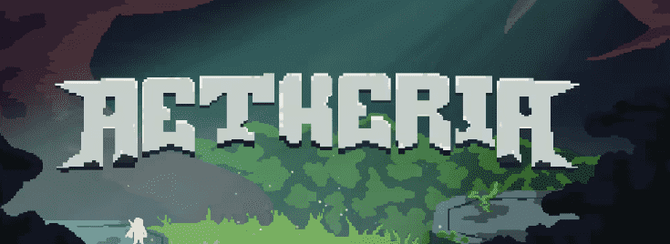

# Aetherian Devas

天神是可爱的、实用的赤壁角色，由 220 多种特征生成，每个特征都有自己的稀有性，任务是保卫 Aetheria 世界。不仅仅是一个头像...
七大建造者将选出 3,333 名天神，他们的任务是保卫 Aetheria 世界对抗提亚马特军团。作为行走在人间的半神，他们拥有操纵光的能力，这种无形的力量构成了任何生物的一部分，赋予他们不朽的天赋和令人难以置信的剑术。我们对艺术的灵感来自于我们所珍视的日本文化和 Roguelike 游戏。

