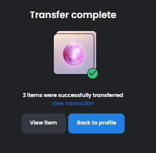

# AFTERLIF3 AI

### AFTERLIF3 AI NFT - 常见问题（FAQ）

##### ▶ 什么是 AFTERLIF3 AI？

AFTERLIF3 AI 是一个 NFT（Non-fungible token）集合。存储在区块链上的数字艺术品集合。

##### ▶ AFTERLIF3 AI 代币有多少？

总共有 2,000 个 AFTERLIF3 AI NFT。目前，401 位所有者的钱包中至少有一个 AFTERLIF3 AI NTF。

##### ▶ 最昂贵的 AFTERLIF3 AI 销售是什么？

最昂贵的 AFTERLIF3 AI NFT 是 [Afterlif3 #896](https://www.nft-stats.com/asset/0x23dd9045c48d86c99bfdd9316a1ca636f06066ef/896)。它于 2022-06-16（2 个月前）以 77.8 美元的价格售出。

##### ▶ 最近卖出了多少 AFTERLIF3 AI？

过去 30 天内售出了 7 个 AFTERLIF3 AI NFT。

##### ▶ 什么是流行的 AFTERLIF3 AI 替代品？

许多拥有 AFTERLIF3 AI NFT 的用户还拥有 [AFTERLIF3 V2](https://www.nft-stats.com/collection/afterlif3-v2)、 [NODES-by MS-DDOS & HOOX](https://www.nft-stats.com/collection/nodes-onchain)、 [Block Flock](https://www.nft-stats.com/collection/block-flock)和 [White Rabbit-ZERO](https://www.nft-stats.com/collection/whiterabbitzero)。

