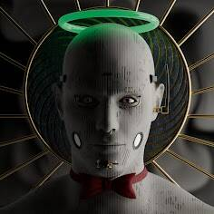

# After Life Genesis Official

After Life 是一个 3D NFT 项目，在以太坊区块链上，围绕来世、灵魂、死亡、恐怖、复仇等黑暗主题展开。我们寻求以艺术和社区的形式探索关于所发生事情的复杂且发人深省的问题在生命结束后给我们。After Life 3D NFT 是单独渲染的，因此不同的特征实际上会影响其他特征的光照/反射。例如，在头部投射金色光芒的金色穿孔，或带有红色肤色的红色背景。我们将在五月的第一周推出我们的 Genesis 系列。我们将很快公布确切的日期。

