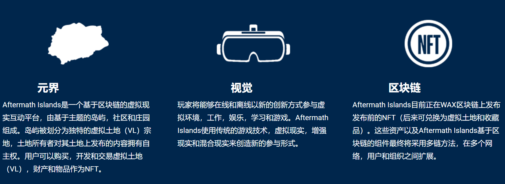
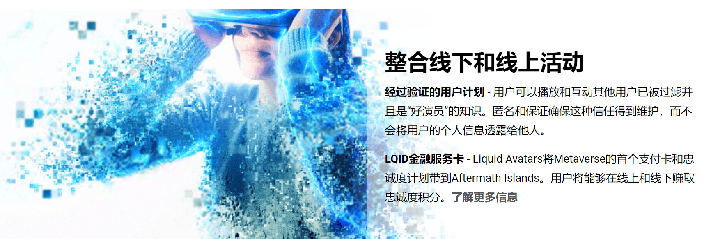
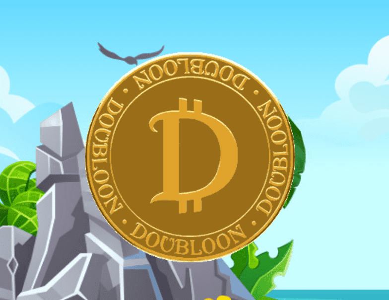

# Aftermath Islands

后果群岛旨在成为鼓励社区参与的战略角色扮演游戏。

更大的游戏环境中包含大量迷你游戏，确保玩家不会对相同的日常任务感到厌倦。选择您想要获取游戏资源和资产的方式。

## 善后群岛 - 虚拟土地

Aftermath Islands为玩家提供了一个有趣而令人兴奋的机会来获得他们自己的虚拟土地（VL）。每种类型的善后岛都有自己的属性，规则和冒险。

- 主题岛屿 – 围绕龙传说、中世纪格斗和外星人战争等个人主题设计的沉浸式事件、任务和游戏玩法。
- 社区岛屿 - 玩家可以参加团体活动，公会，俱乐部或进行单人冒险。
- 庄园群岛 - 拥有一个小岛的很大一部分，仅限于几十名玩家

# 游戏道具及更多

各种住宅、基础设施、武器、工具、车辆和其他可玩物品计划通过购买、任务和其他促销活动在游戏中获得。

Aftermath Islands正在为3D创作者开发参与并从其设计中获得收入的机会，从而增加游戏内经济并在全球范围内激活游戏和3D社区。

# 实用型代币

Doubloons（Dubs）是Aftermath Islands的游戏内货币，将在发布之前在即将发布的版本中提供。Doubloons是用于支付Aftermath Islands元宇宙中商品和服务的数字令牌，并将得到区块链标记化生态系统的支持。

# 新体验和冒险等待着

每个岛屿都提供广泛的游戏选择和任务，适合新手和有经验的玩家。这些激活将允许玩家升级并获得奖励。

奖章 - 爱好，职业，能力
善后岛职业系统通过奖章运行，奖章是游戏中的数字资产，使用户能够执行职业，爱好和能力。奖章可以使用 DUBS 通过 Aftermath Islands 市场获得。奖章采用NFT的形式，收购后可在二级市场上交易。通过使用和其他游戏内激活，勋章可以升级以提高熟练度。

善后群岛旨在促进社区参与新任务和活动的开发和部署。用户将能够在公共讨论板上发布和评论，在那里可以分享和开发任务和活动的想法

