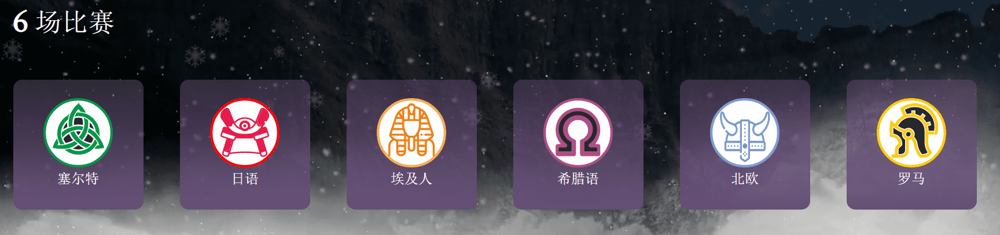
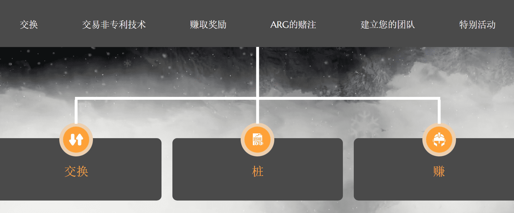

# Age of Cryptology

Age Of Cryptology（AC）是部署在Binance Smart Chain上的Play & Earn生态系统，它结合了惊心动魄和娱乐的知识以及区块链技术提供的可能性。在AOC中，每笔资产都是NFT（不可回令牌），它允许您成为该资产的唯一所有者并完全控制它。

游戏内经济还包括一个名为“Aureo”（一种前罗马货币）的实用代币，该代币将作为主要游戏货币。Aureo具有现实世界的价值，因为它可以兑换其他加密货币，甚至可以兑换真钱（美元或欧元等法定货币）。这是Play & Earn游戏的令人敬畏的新概念！我们的愿景是将Play & Earn的概念发展成一个更成熟的概念，其中战略和技能也很重要。我们不想成为一个“坐下点击这里”的游戏。在追求这个“Master & Earn”的新概念时，我们希望我们的游戏内算法和概率完全透明，以便您能够分析它并创建自定义策略。

AOC的整个情节发生在盖亚的宇宙中。自大战结束以来，盖亚一直生活在和平之中。这是一个值得探索的世界，人口稠密的地区和荒野。在城市中，你的英雄是安全的，可以执行各种动态。其中一些对于所有城市都是相同的，而另一些则特定于每个位置。在荒野地区，你的英雄会遇到敌人和野生动物。其中一些是无害的，但另一些是致命的。在进入一个未知的地方之前，请三思而后行，因为这可能是你做出的最后一个决定。

在盖亚有7个王国：Aureum（首都），罗马，希腊，日本，埃及，北欧和凯尔特人。他们每个人都属于不同的文明，有着不同的文化和思想。还有一个中心城市，Aureum，所有文明都可以共存......每个王国都有其文明的特殊功能，该文明的英雄/物品的概率更高，使用该文明的英雄时，赌注的奖励更高，向该文明的神祈祷等等。愿众神保佑你！

Aureo（AUR）是在区块链上找到的实用型代币，可以在Pancakeswap，Poocoin和Dextools上购买。您可以使用AUR进行游戏内AOC功能，例如购买NFT（英雄和物品），在银行中抵押以获得ARG，加入斗兽场等等

