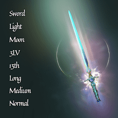

# Age of Zen Swords

唯一的 NFT 系列” 第一个结合 LOOT 和 Heroes 的 NFT 系列 第一个进入 AOZ 巨大元宇宙的创世纪铸币厂 AOZ 代表禅宗时代，这是 3 亿年后地球的故事。中世纪和亚洲的影响，7,777 位具有潜在英雄能量的个体觉醒。以“用户创造的 NFT 系列”的概念，用户可以积极加入和领导 DAO，参与开发未来的故事。第一个创世铸币AOZ，进入第一个系列NFT AOZ的浩瀚元宇宙，结合了LOOT和英雄，是Age of Zen的缩写，是3亿年后地球的故事。在这里，7777人拥有英雄的能量在'Mahadvipa'中醒来。

