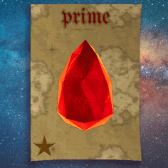

# AGENT1 Artifact

10,001 个 NFT - 在以太坊区块链上运行的独特数字收藏程序。它们是 Morphing NFT，在您的钱包中移动时会改变形式。**Agent1s 是为即将到来的MetaVerse 游戏**做准备的第一批程序。它们以文本开头，您可以从浏览器**复制和粘贴。**上面试试！每个 Agent1（他们成对出现）都有自己的行为和优势。它们都是独一无二的，具有随机生成的特征。多态代理 1 将随着您的行为、钱包和交易而变化。在升级日期之前，您采取的每一项操作，您使用 #Agent1、#A10001 或 #AgentsUnite 推文/转发的每条消息都会影响项目的变形方式。从点.. 到 3D。

