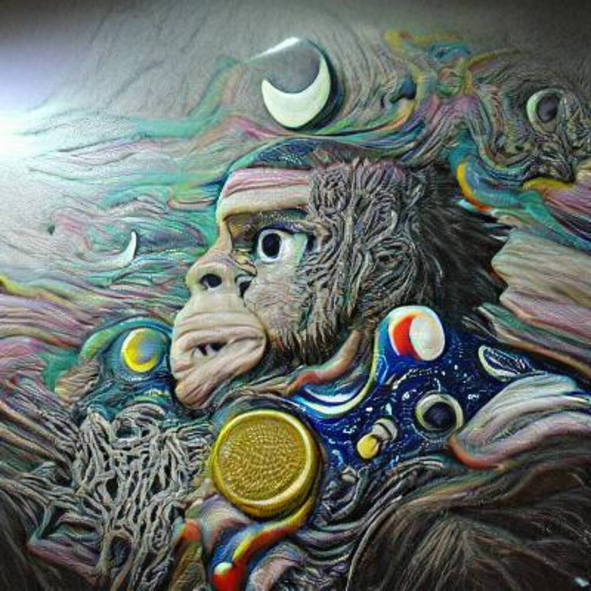

# AIApes.io

##### ▶ 什么是 AIApes.io？

AIApes.io 是一个 NFT（不可替代令牌）集合。存储在区块链上的数字艺术品集合。

##### ▶ AIApes.io 代币有多少？

总共有 4,139 个 AIApes.io NFT。目前，133 位所有者的钱包中至少有一个 AIApes.io NTF。

##### ▶ 最昂贵的 AIApes.io 销售是什么？

最昂贵的 AIApes.io NFT 是 . 它于 2022 年 6 月 22 日（2 个月前）以 0.5 美元的价格出售。

##### ▶ 最近卖出了多少AIApes.io？

过去 30 天内售出了 15 个 AIApes.io NFT。

##### ▶ AIApes.io 需要多少钱？

过去 30 天，最便宜的 AIApes.io NFT 销售额低于 1 美元，最高销售额超过 1 美元。AIApes.io NFT 在过去 30 天内的中位价格为 1 美元。

##### ▶ 什么是流行的 AIApes.io 替代品？

许多拥有 AIApes.io NFT 的用户还拥有 [Museum The White Room](https://www.nft-stats.com/collection/museum-the-white-room)、 [Mutant Okay Bears](https://www.nft-stats.com/collection/mutantokaybearsnft)、 [DoNotMintThis](https://www.nft-stats.com/collection/donotmintthis)和 [Old Legacy](https://www.nft-stats.com/collection/old-legacy)。

