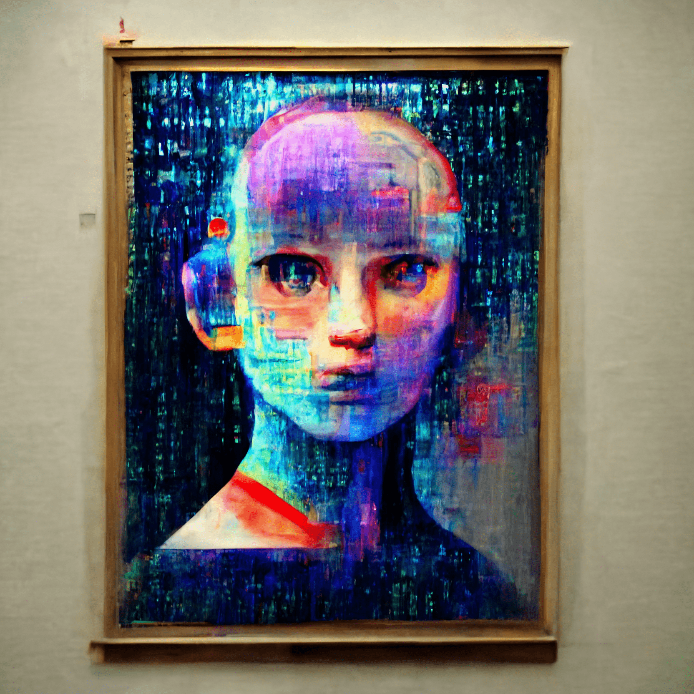

# AI art is not art

人工智能机器艺术。它是什么？购买它并找出答案。图像是根据简短的文本描述创建的，神经网络会生成各种各样的明亮多彩的图像。该模型理解大量概念，并生成现实世界中不存在的全新图像和对象。

NFT 令牌的所有图像都是使用 DALL-E 神经网络构建的。我们的目标是创建一个“多模式”神经网络，以多种模式（主要是文本和视觉）学习概念，以更好地理解世界。Transformer 被教导将文本和图像标记自回归建模为单个数据流。为了学习如何渲染图像，该模型在 Christofari 集群上在 512 个 TESLA V100 GPU 上训练了 37 天，然后在 128 个 GPU 上又训练了 11 天——总共 20352 个 GPU 天。

出售 NFT 代币的所有收益将用于开发用于各种应用的神经网络和人工智能。

