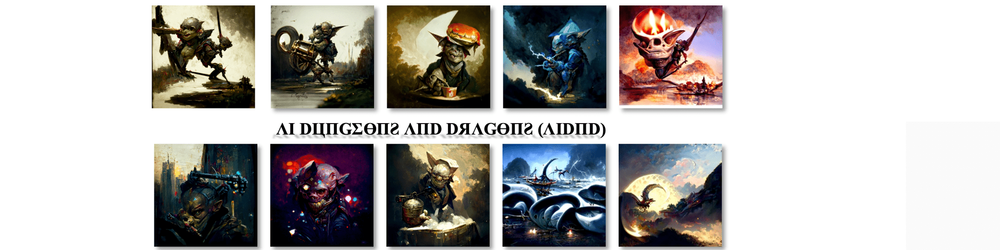

# AI Dungeons and Dragons Genesis

正如我们所提到的，这是一个 Series 0 Genesis AI DND 合集。去他妈的地精 AI 团队，他们甚至不能透露。全部免费，每个钱包 1 个。894 AI 生成了生活在龙与地下城 (DND) 虚拟世界中的所有幻想种族的油画。CC0 原创艺术，系列 0 Genesis 项目。50% 的收入直接归算法开发人员和艺术家所有。享受车程！

##### ▶ 什么是 AI 龙与地下城创世纪？

AI Dungeons and Dragons Genesis 是一个 NFT（Non-fungible token）集合。存储在区块链上的数字艺术品集合。

##### ▶ 存在多少 AI 龙与地下城的创世纪代币？

总共有 984 个 AI 龙与地下城 Genesis NFT。目前 736 位所有者的钱包中至少有一个 AI Dungeons and Dragons Genesis NTF。

##### ▶ 最昂贵的 AI 龙与地下城创世纪特卖是什么？

最昂贵的 AI Dungeons and Dragons Genesis NFT 是 [AI Dungeons and Dragons (AIDND)](https://www.nft-stats.com/asset/0x2e29f37c5942976202f95df175dcc28dad17d461/804)。它于 2022-06-07（3 个月前）以 63.5 美元的价格售出。

##### ▶ 最近卖出了多少台 AI 龙与地下城创世纪？

过去 30 天内共售出 36 个 AI 龙与地下城 Genesis NFT。

##### ▶ 一个 AI 龙与地下城的创世纪需要多少钱？

在过去 30 天里，最便宜的 AI Dungeons and Dragons Genesis NFT 销售额低于 18 美元，最高销售额超过 136 美元。过去 30 天，AI Dungeons and Dragons Genesis NFT 的中位价格为 54 美元。

