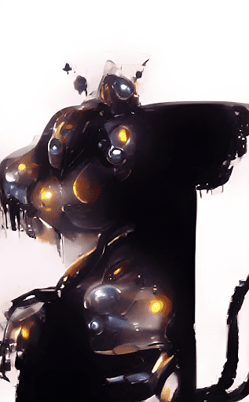

# AI MinionSilhouette

##### ▶ 什么是 AI MinionSilhouette？

AI MinionSilhouette 是一个 NFT（不可替代令牌）集合。存储在区块链上的数字艺术品集合。

##### ▶ 存在多少 AI MinionSilhouette 代币？

总共有 201 个 AI MinionSilhouette NFT。目前，142 位所有者的钱包中至少有一个 AI MinionSilhouette NTF。

##### ▶ 最昂贵的 AI MinionSilhouette 销售是什么？

售出的最昂贵的 AI MinionSilhouette NFT 是 [Ai MinionSilhouette #28](https://www.nft-stats.com/asset/0x0f7709dff61ac707234cc8628fcc9cc4ab3d585c/28)。它于 2022-06-19（2 个月前）以 11 美元的价格售出。

##### ▶ 最近卖出了多少 AI MinionSilhouette？

过去 30 天内售出了 3 个 AI MinionSilhouette NFT。

[Ai MinionSilhouette #28 售价 11 美元 2 个月前]

