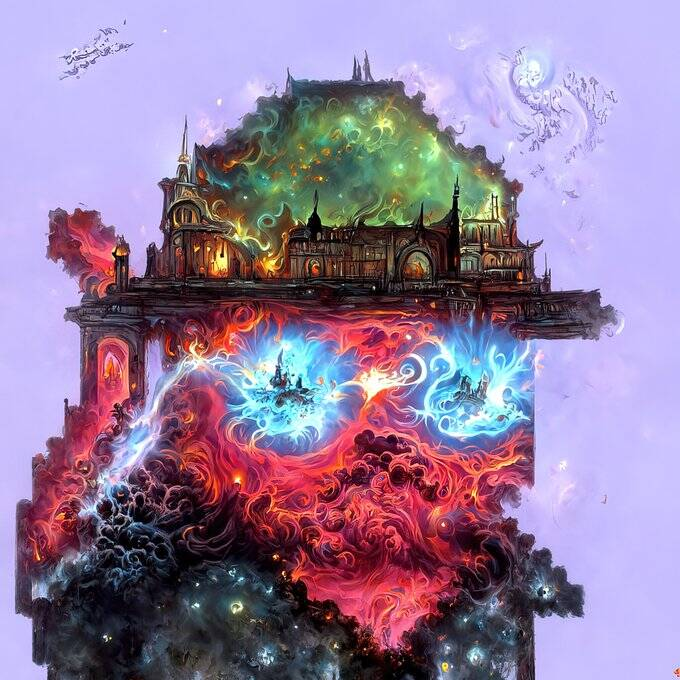

# Ai Mooncatz

在过去 7 天内售出 8 次。AI Punks Art 的总销售额为 20.75 美元。一份 AI Punks Art NFT 的平均价格为 2.6 美元。有 1,349 名 AI Punks Art 所有者，拥有总供应量 5,000 个代币。

只是 AI 做 AI 艺术👀

为了让每张图片都独一无二，我们的 AI 为每张图片构建了 600 万种可能的组合总共有 5,000 个 AI Punks Art NFT。目前，1,349 位车主的钱包中至少有一个 AI Punks Art NTF。售出的最昂贵的 AI Punks Art NFT 是 [AIPunks #4040](https://www.nft-stats.com/asset/0x212f6b5ab5efc43db2899a64ef2d1c10ad35ebc7/4040)。它于 2022-06-10（2 个月前）以 360.7 美元的价格售出。过去 30 天，最便宜的 AI Punks Art NFT 销售额低于 3 美元，最高销售额超过 28 美元。过去 30 天 AI Punks Art NFT 的中位价格为 9 美元。

