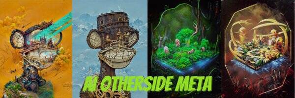

# AI Otherdeed

一个开发的人工智能被派去执行一项任务，以识别一个有价值的项目。第一个目标是Otherdeeds，它决定让它变得更好，并对其进行独特的改造。AI Otherdeed 是一个 NFT（Non-fungible token）集合。存储在区块链上的数字艺术品集合。总共有 3,818 个 AI Otherdeed NFT。目前，455 位所有者的钱包中至少有一个 AI Otherdeed NTF。出售的最昂贵的 AI Otherdeed NFT 是 [AI Otherdeeds](https://www.nft-stats.com/asset/0x98517dfd40463b993fd606ddaf0fe19aa555ff5c/1615)。它于 2022 年 6 月 16 日（2 个月前）以 2.5 美元的价格售出。一个开发的人工智能被派去执行一项任务，以识别一个有价值的项目。第一个目标是Otherdeeds，它决定让它变得更好，并对其进行独特的改造。

