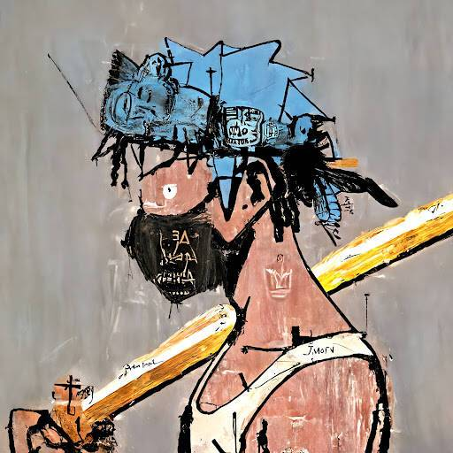

# AI-Zuki by GreyStudio.AI

##### ▶ GreyStudio.AI 的 AI-Zuki 是什么？

GreyStudio.AI 的 AI-Zuki 是一个 NFT（不可替代令牌）集合。存储在区块链上的数字艺术品集合。

##### ▶ GreyStudio.AI 的 AI-Zuki 代币有多少？

GreyStudio.AI NFT 总共有 555 个 AI-Zuki。目前，431 位所有者的钱包中至少有一个由 GreyStudio.AI NTF 设计的 AI-Zuki。

##### ▶ GreyStudio.AI 出售的最贵的 AI-Zuki 是什么？

GreyStudio.AI NFT 出售的最昂贵的 AI-Zuki 是 GreyStudio.AI 的 [AI-Zuki #134](https://www.nft-stats.com/asset/0x2aa19d77572e06899c091a81d9a6f7644f9b5435/134)。它于 2022 年 6 月 16 日（2 个月前）以 433.4 美元的价格售出。

##### ▶ GreyStudio.AI 最近卖出了多少台 AI-Zuki？

GreyStudio.AI NFT 在过去 30 天内售出 72 个 AI-Zuki。

##### ▶ GreyStudio.AI 的 AI-Zuki 需要多少钱？

在过去 30 天里，GreyStudio.AI NFT 最便宜的 AI-Zuki 销售额低于 9 美元，最高销售额超过 26 美元。GreyStudio.AI NFT 的 AI-Zuki 在过去 30 天内的中位价格为 15 美元。

##### ▶ GreyStudio.AI 流行的 AI-Zuki 替代品有哪些？

许多拥有 GreyStudio.AI NFT 的 AI-Zuki 的用户还拥有 [Masked Ape NFT](https://www.nft-stats.com/collection/maskedapenft)、 [Lynx Strezzo](https://www.nft-stats.com/collection/lynxstrezzo)、 [Baby-Bulls](https://www.nft-stats.com/collection/babybulls)和 [Jackside](https://www.nft-stats.com/collection/jackside)。

