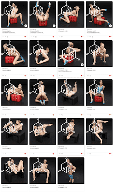

# AIArt - 5c6dSks7hR

Digital AI Gallery 是 Aiart 作品的集合，围绕着联系、纯洁和无限的梦想境界等主题展开。

创建是关于通过策划、删除 NFT 集合来进行治疗。Polygon 是一个区块链，可提供与 ETH、USDC 和 DAI 等以太坊货币的可扩展、安全和即时交易。在 Polygon 区块链上购买 NFT 有很多优势，包括：

没有更昂贵的钱包初始化费用
买卖 NFT 是无气体的
仅在将 ETH 资金转移到 Polygon 网络时才需要支付 Gas 费
在 Polygon 上购买 NFT 需要使用 Polygon ETH。为了在 Polygon 上使用您的以太币，您必须首先将它们“桥接”到 Polygon 区块链。

