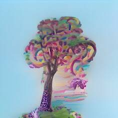

# AIBoredApes

**什么是 AIBoredApes？**
AIBoredApes NFT 是由 AI 技术生成的高保真图像，主要是 SR3 和 CDM，可用于任何类型的印刷艺术。

**AIBoredApes NFT 集合将使用什么区块链？**
AIBoredApes NFT 将驻留在以太坊区块链上。

**AIBoredApes NFT 合集中有多少个 NFT？**
AIBoredApes NFT 集合中有 10,000 个独特的 NFT。

**铸造 AIBoredApes NFT 的价格是多少？**
前 2500 您可以免费获得。剩余的 7500 个，每个价格为 0.001 ETH。

**有预售清单吗？**
没有！每个人都有平等的机会铸币。

**在一次交易中可以铸造多少 AIBoredApes？**
在免费铸币期间（前 2500 个 NFT），每笔交易最多可以铸币 3 个 AIBoredApes。对于剩余的 7500 个 NFT - 每 1 笔交易最多 10 个 AIBoredApes。

