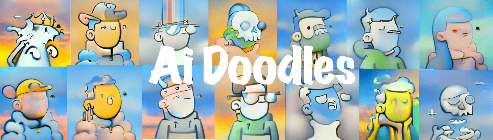

# Ai Doodle

只是一些由人工智能涂鸦的令人难以置信的艺术我们使用排名过的涂鸦并精心训练了一个 GAN 模型超过 24 小时 MINT NOW

▶ 什么是 AI 涂鸦？

Doodles By AI 是一个 NFT（非同质代币）集合。存储在区块链上的数字艺术品集合。

##### ▶ 有多少 Doodles By AI 代币？

AI NFT 总共有 9,999 个涂鸦。目前，1,720 位业主的钱包中至少有一张 Doodles By AI NTF。

##### ▶ 最近卖出了多少 Doodles By AI？

过去 30 天共售出 0 Doodles By AI NFT。

##### ▶ 流行的 Doodles By AI 替代品有哪些？

许多拥有 Doodles By AI NFTs 的用户还拥有 [RektGoblins](https://www.nft-stats.com/collection/rektgoblins)、 [notBasquiart](https://www.nft-stats.com/collection/notbasquiart)、 [Shroom Goons](https://www.nft-stats.com/collection/shroom-goons)和 [AIGods](https://www.nft-stats.com/collection/aigods)。

