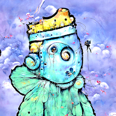

# Ai Doodles Art

独特的人工智能通过不同的艺术风格激发了漂亮涂鸦的艺术梦想。在他们变得如此愚蠢之后，他们开始梦想成为真正的迷幻艺术。每一个都是独一无二的，非常独特。

##### ▶ 什么是涂鸦 AI - 刻录模式？

DOODLES AI - BURN MODE 是一个 NFT（不可替代令牌）集合。存储在区块链上的数字艺术品集合。

##### ▶ 存在多少 DOODLES AI - BURN MODE 代币？

总共有 48 种 DOODLES AI - BURN MODE NFT。目前 23 位所有者的钱包中至少有一个 DOODLES AI - BURN MODE NTF。

##### ▶ 最近卖出了多少 DOODLES AI - BURN MODE？

在过去 30 天内售出 0 份 DOODLES AI - BURN MODE NFT。

