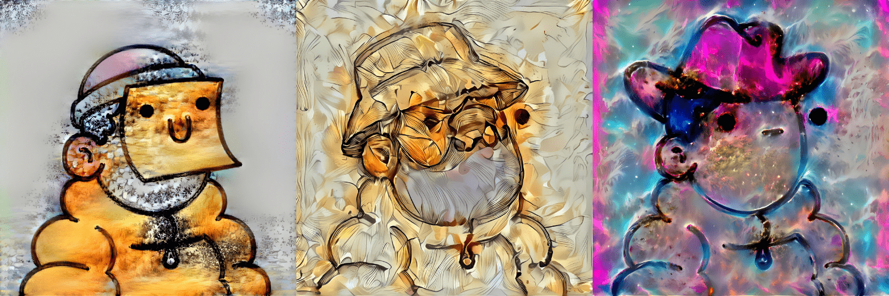

# DoodlesAI

Space Doodles 是您进入银河系的第一次冒险，以发现快乐和彩虹呕吐。这是向收藏家展示我们的宇宙的第一步，它拥有由 Burnt Toast 设计的数十艘宇宙飞船。

你的涂鸦在寻找什么？它要去哪里？你附近还有多少其他涂鸦者？在我们揭示宇宙的第一步中，您的涂鸦是回答这些问题的关键。

所有涂鸦者都可以免费领取他们的太空涂鸦，并在他们的个人宇宙飞船中获得自己独特的外观和能力。“膀胱管理”和“驾驶能力”等统计数据定义了 Doodles 在太空中的能力。

##### ▶ 什么是 DoodlesAI？

DoodlesAI 是一个 NFT（非同质代币）集合。存储在区块链上的数字艺术品集合。

##### ▶ DoodlesAI 代币有多少？

总共有 1,708 个 DoodlesAI NFT。目前，244 位所有者的钱包中至少有一个 DoodlesAI NTF。

##### ▶ 最近卖出了多少 DoodlesAI？

过去 30 天内售出 0 个 DoodlesAI NFT。

