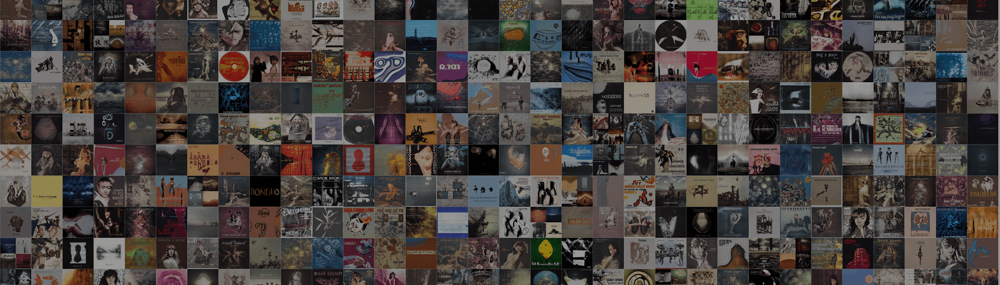

# AiLBUMS by GEN.ART

Alexander Reben 的 AiLBUMS 是 GEN.ART 的 AI Drops 的第二个。这是一系列与 AI “协作”创建的生成作品。Alex 浏览了数十万张专辑封面图像，并选择了 50,000 张图像包含在数据集中. 然后，该数据集被用于训练一个 AI 算法，该算法试图了解专辑封面图像是什么。然后，他使用一个读取他的脑电波、注视和身体信号的系统来从系统中选择一个输出。亚历山大·雷本 (ArtBoffin)
相册
AiLBUMS 是与人工智能“合作”创作的一系列生成作品。这位艺术家浏览了数十万张专辑封面图片，并选择了 50,000 张图片以包含在数据集中。

