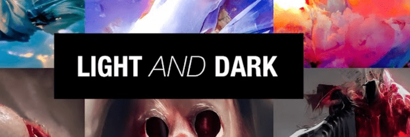

# Light and Dark by Phil Bosua

Light and Dark 是 AI 艺术家 Phil Bosua 的创世纪系列。100 件独特的 AI 生成艺术品。

“总是有光明和黑暗。光明是爱，黑暗是缺乏爱。作为个人，我们必须在成熟和正直的自我认识或他人的认可之间做出选择。

用你决定考虑的一切来探索你的想法。忠于自己，世界将拥有它需要的一切。”Phil Bosua 的 Light and Dark 是一个 NFT（不可替代代币）系列。存储在区块链上的数字艺术品集合。Phil Bosua NFT 总共有 100 个 Light and Dark。目前，61 位所有者的钱包中至少有一本 Phil Bosua NTF 的 Light and Dark。Phil Bosua NFT 出售的最昂贵的 Light and Dark 是 [Light #3](https://www.nft-stats.com/asset/0x109678a2521c966bb9bfceb57262e503625dafa4/5)。它于 2022 年 6 月 12 日（2 个月前）以 101 美元的价格售出。过去 30 天内售出了 1 个由 Phil Bosua NFT 制作的 Light and Dark。

