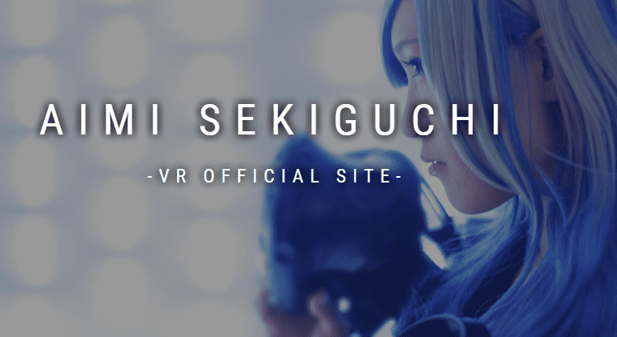

# Aimi Sekiguchi Collection

作为在 VR 空间中绘制 3D 艺术的 VR 艺术家活跃。 艺术制作和现场绘画舞台表演在日本和海外 （美国、德国、法国、俄罗斯、阿联酋、新加坡、泰国、马来西亚等）进行。VR艺术家 她在虚拟现实空间中绘制3D艺术。 在日本、美国、德国、法国、俄罗斯、阿联酋、新加坡、泰国、马来西亚等多个国家进行现场绘画，AimiSekiguchi 是一个 NFT（不可替代令牌）集合。存储在区块链上的数字艺术品集合。总共有 7 个 AimiSekiguchi NFT。目前有 6 位所有者的钱包中至少有一个 AimiSekiguchi NTF。

