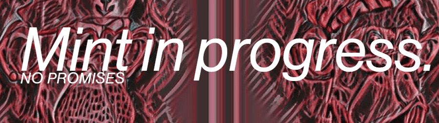

# AI Moonbirbs

NotAIMoonbirds NFT 在过去 7 天内售出 5 次。NotAIMoonbirds 的总销售额为 19.72 美元。NotAIMoonbirds NFT 的平均价格为 3.9 美元。NotAIMoonbirds 拥有者 593 名，总共拥有 3,752 个代币。

不是 10,000 只 AiMoonBirds 不是我们用艺术和精确度创造出来的NotAIMoonbirds 是一个 NFT（非同质代币）集合。存储在区块链上的数字艺术品集合。总共有 3,752 个 NotAIMoonbirds NFT。目前，593 位所有者的钱包中至少有一个 NotAIMoonbirds NTF。售出的最昂贵的 NotAIMoonbirds NFT 是 [Not AIMoonbird](https://www.nft-stats.com/asset/0x0dfe95776a2189a3dd7534498c79244cb6b97bad/741)。它于 2022 年 6 月 22 日（2 个月前）以 4.4 美元的价格售出。

