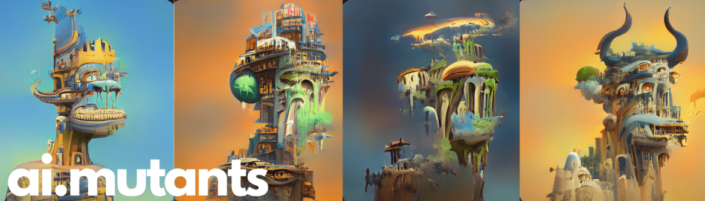

# AIMutant

由 AI 改造的 10,000 个突变体的集合。▶ 什么是 AIMutant？

AIMutant 是一个 NFT（Non-fungible token）集合。存储在区块链上的数字艺术品集合。

##### ▶ 存在多少个 AIMutant 代币？

总共有 9,999 个 AIMutant NFT。目前，1,285 位所有者的钱包中至少有一个 AIMutant NTF。

##### ▶ 最昂贵的 AIMutant 销售是什么？

出售的最昂贵的 AIMutant NFT 是 [AI Mutant #5679](https://www.nft-stats.com/asset/0xb11ef53e7a84ee956dd9bc30333ba48638bcb991/5679)。它于 2022-06-07（3 个月前）以 1.1 美元的价格出售。

##### ▶ 最近卖出了多少 AIMutant？

过去 30 天内售出了 8 个 AIMutant NFT。

##### ▶ 什么是流行的 AIMutant 替代品？

许多拥有 AIMutant NFT 的用户还拥有 [(Test NFT) DownBad Polaroids](https://www.nft-stats.com/collection/test-nft-downbadpolaroids)、 [AI Punks Revolution](https://www.nft-stats.com/collection/ai-punks-revolution)、 [Raid Project (Polygon)](https://www.nft-stats.com/collection/raid-project-polygon)和 [Omni Moon Birds](https://www.nft-stats.com/collection/omni-moon-birds)。

