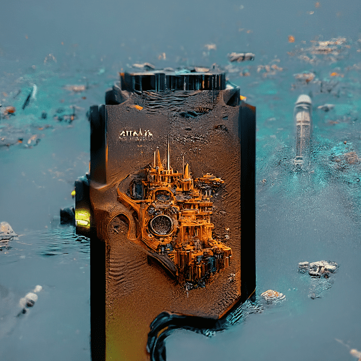

# AIPunks Collection

价格 0.005，前 2000 免费（每个钱包最多 3 个）。揭示 05/26。

令人惊叹的 10 000 个 AI 版本的传奇朋克系列。科技是未来，NFT 是艺术的未来！受朋克和 AIMoonbirds 的启发，但与他们无关。AIPunks Collection 是一个 NFT（Non-fungible token）集合。存储在区块链上的数字艺术品集合。总共有 2,057 个 AIpunks Collection NFT。目前，665 位所有者的钱包中至少有一个 AIpunks Collection NTF。出售的最昂贵的 AIPunks Collection NFT 是 [AIPunks](https://www.nft-stats.com/asset/0x682fe81f617d66928d7cd052332c10d76a7e516e/443)。它于 2022-06-10（2 个月前）以 8.8 美元的价格售出。过去 30 天内共售出 1 个 AIpunks Collection NFT。

