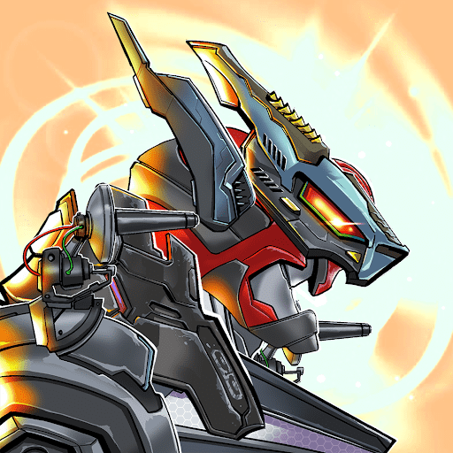

# AIRobots ETH

AIRobots ETH NFT 在过去 7 天内售出 11 次。 AIRobots ETH 的总销售额为 2.91 美元。一个 AIRobots ETH NFT 的平均价格为 0.3 美元。 AIRobots ETH 拥有者有 546 名，总供应量为 4,444 个。

以太坊区块链上的 4444 个 AIRobots。科技是未来，NFT 是艺术的未来▶ 什么是 AIRobots ETH？
AIRobots ETH 是一个 NFT（Non-fungible token）集合。存储在区块链上的数字艺术品集合。
▶ AIRobots ETH 代币有多少？
总共有 4,444 个 AIRobots ETH NFT。目前 546 位所有者的钱包中至少有一个 AIRobots ETH NTF。
▶ 最昂贵的 AIRobots ETH 销售是什么？
出售的最昂贵的 AIRobots ETH NFT 是 Unchained MEC #1585。它于 2022-07-02（大约 2 个月前）以 1 美元的价格出售。
▶ 最近卖出了多少 AIRobots ETH？
过去 30 天内售出了 12 个 AIRobots ETH NFT。
▶ AIRobots ETH 的价格是多少？

